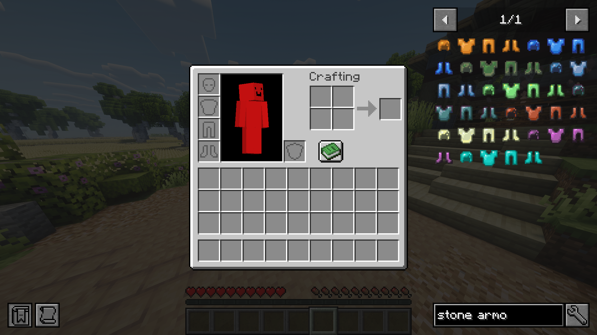
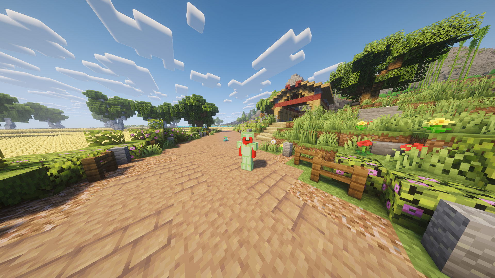
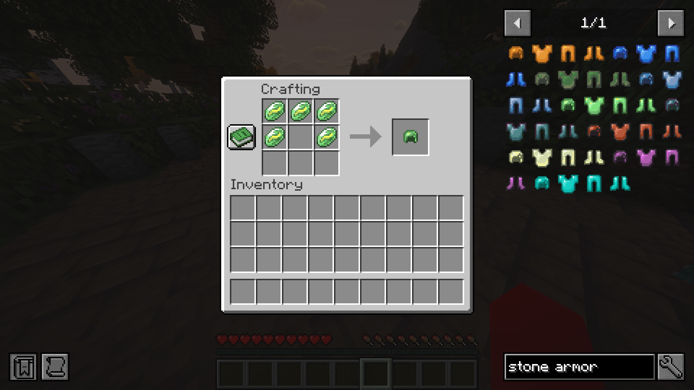

# Cobblemon: Armour

A Cobblemon side-mod that introduces 10 unique armour sets craftable from the cobblemon evolution stones. 
Standard minecraft crafting for the armour.

---

## Showcase

### Armour Items

### Armour Equipped

### Crafting Recipe

---

## Features

- 10 armour sets crafted from Cobblemon evolution stones
- Unique set bonus effect when wearing all 4 pieces
- Standard minecraft armour crafting.

---

## Armour Sets & Set Bonuses

| Armour Set | Evolution Stone |                    Set Bonus                     |
| :--- | :---: |:------------------------------------------------:|
| Fire Stone Armour | Fire Stone |                 Fire Resistance                  |
| Water Stone Armour | Water Stone | Water Breathing + Dolphins Grade + Conduit Power |
| Leaf Stone Armour | Leaf Stone |               Luck + Slow Falling                |
| Thunder Stone Armour | Thunder Stone |                  Speed                   |
| Sun Stone Armour | Sun Stone |                    Jump Boost                    |
| Moon Stone Armour | Moon Stone |                   Night Vision                   |
| Dawn Stone Armour | Dawn Stone |                      Haste                       |
| Dusk Stone Armour | Dusk Stone |                   Invisibility                   |
| Shiny Stone Armour | Shiny Stone |                   Health Boost                   |
| Ice Stone Armour | Ice Stone |                    Resistance                    |

---

## Dependencies

| Mod Name | Required Version | Purpose | Link |
| :--- | :---: | :--- | :---: |
| **NeoForge** | `21.1.182+` | Mod Loader | [Download](https://neoforged.net) |
| **Cobblemon** | `1.5.2+1.21.1` | Core Pokémon API | [Download](https://modrinth.com/mod/cobblemon) |
| **JEI** | `19.0+` | Recipe Viewer (Optional) | [Download](https://modrinth.com/mod/jei) |

---

## Installation

1. Ensure you have **NeoForge 21.1.182+** installed
2. Drop `cobblemon-x.x.x.jar` into your `mods/` folder
3. Drop `cobblemonarmours-x.x.x.jar` into your `mods/` folder
4. Launch the game

---

## License

CobblemonArmours is licensed under the [CobblemonArmours License v1.0](LICENSE).
You are free to include this mod in modpacks with credit. Commercial use is prohibited.